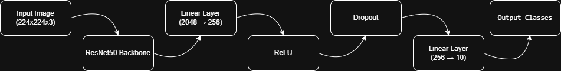
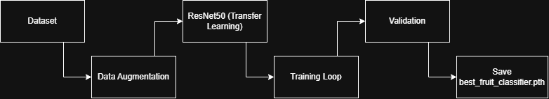
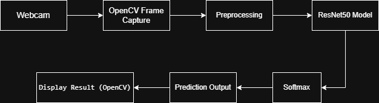
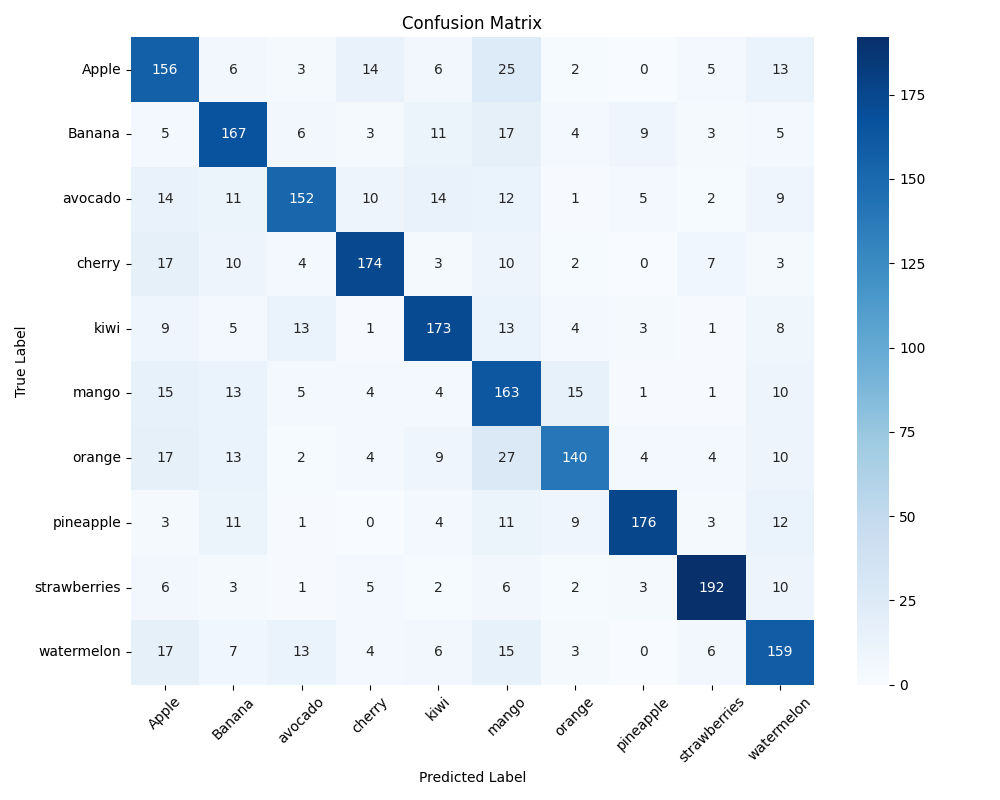
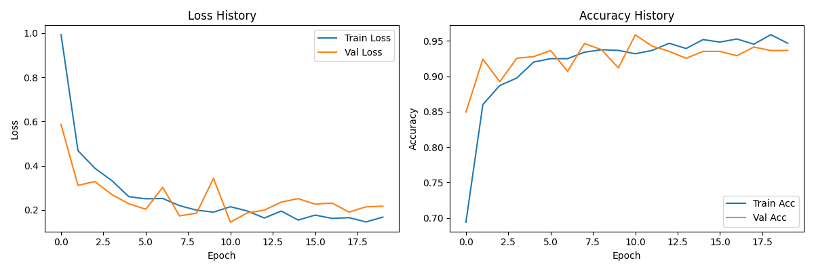

# 🥭 Real-Time Fruit Classification using ResNet50

## 📌 Project Overview

This project implements a **real-time fruit classification system** using a fine-tuned **ResNet50 deep learning model**. The system classifies 10 fruit classes using a webcam feed with high accuracy and real-time performance.

The model was trained using **transfer learning** and optimized for both accuracy and inference speed.

---

## 🎯 Features

* Real-time webcam fruit classification
* Transfer learning using ResNet50
* Mixed precision training (AMP)
* Confusion matrix & performance analysis
* Model confidence analysis
* GPU acceleration support
* FPS monitoring during inference

---

## 🧠 Model Architecture

**Base model:** ResNet50 (pretrained on ImageNet)

**Custom classification head:**

* Linear (2048 → 256)
* ReLU
* Dropout (0.2)
* Linear (256 → 10 classes)

Transfer learning was used by freezing early layers and fine-tuning final layers.

---

## 🧱 Model Architecture Diagram



---

## 🔄 Training Pipeline



---

## ⚡ Inference Pipeline


---

## 🖥 System Architecture



---

## 🗂 Dataset Structure

Dataset should be structured as:

```
dataset/
├── train/
│   ├── Apple/
│   ├── Banana/
│   └── ...
│
├── test/
│   ├── Apple/
│   ├── Banana/
│   └── ...
├── predict/
│   ├── Apple/
│   ├── Banana/
│   └── ...
```

---

## 📊 Training Details

* Optimizer: AdamW
* Loss: CrossEntropyLoss
* Batch Size: 64
* Epochs: 20
* Mixed Precision Training enabled

---

## 📈 Results

* Real-time inference speed: **8–14 FPS**
* High classification confidence (up to 100%)
* Strong real-world performance

---

## 🖼 Demo Results

### Banana Detection


### Apple Detection


### Mango Detection(From phone screen)


### Kiwi Detection(From phone screen)


### Banana Detection(From phone screen)


### Apple Detection(From phone screen)


---

## 📉 Confusion Matrix



---

## 📊 Training History



---

## 📥 Pretrained Model

Download model from Google Drive:

https://drive.google.com/file/d/1IgpX71ZzCuzRjKLJq7WJmUMDstTmb8oF/view?usp=sharing

Place inside:

```
models/best_fruit_classifier.pth
```

---

## ⚙️ Installation

Clone repository:

```
git clone https://github.com/Aaaaaaaayush/fruit-classifier-realtime.git
cd fruit-classifier-realtime
```

Install dependencies:

```
pip install -r requirements.txt
```

---

## ▶️ Run Real-Time Inference

```
python src/realtime_inference.py
```

Press **q** to quit.

---

## 🧪 Model Evaluation

```
python src/analyze_model.py
```

---

## 🏗 Train Model

```
python src/train_fruit_classifier.py
```

---

## 📁 Project Structure

```
fruit-classifier-realtime/
│
├── src/
├── demo/
├── diagrams/
├── models/
├── README.md
├── requirements.txt
└── .gitignore
```

---

## 🔮 Future Improvements

* Deploy using Streamlit / FastAPI
* Convert to ONNX / TensorRT
* Mobile deployment
* Improve inference speed

---

## 👨‍💻 Authors

Aayush Bhanushali
Anush Singh

Machine Learning Engineers
